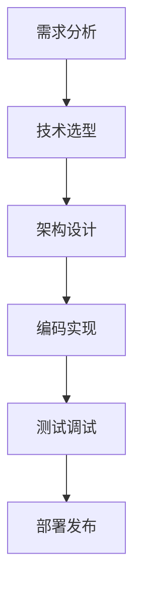

# 个人项目开发心得

最近完成了几个个人项目，想和大家分享一下开发过程中的收获和思考。

## 项目概述

### 1. 个人网站
- **技术栈**：HTML, CSS, JavaScript
- **特色功能**：主题切换、打字机效果、GitHub API集成
- **学到的**：响应式设计、API调用、DOM操作

### 2. 学生信息管理系统
- **技术栈**：Vue.js + Node.js + MySQL
- **核心功能**：用户管理、数据统计、日志记录
- **挑战**：前后端分离架构

## 开发流程



## 遇到的挑战

### 跨域问题

在前后端分离开发中，经常遇到CORS问题：

```javascript
// 解决方案：在Express服务器中配置CORS
const cors = require('cors');
app.use(cors({
    origin: 'http://localhost:3000',
    credentials: true
}));
```

### 状态管理

Vue项目中的状态管理：

```javascript
// 使用Vuex管理全局状态
const store = new Vuex.Store({
    state: {
        user: null,
        isLoading: false
    },
    mutations: {
        SET_USER(state, user) {
            state.user = user;
        }
    },
    actions: {
        async fetchUser({ commit }, userId) {
            commit('SET_LOADING', true);
            try {
                const user = await api.getUser(userId);
                commit('SET_USER', user);
            } catch (error) {
                console.error('获取用户失败:', error);
            } finally {
                commit('SET_LOADING', false);
            }
        }
    }
});
```

## 性能优化

### 代码分割

```javascript
// 路由懒加载
const Home = () => import('./views/Home.vue');
const About = () => import('./views/About.vue');

const routes = [
    { path: '/', component: Home },
    { path: '/about', component: About }
];
```

### 图片优化

1. **使用WebP格式** - 更小的文件大小
2. **懒加载** - 减少初始加载时间
3. **响应式图片** - 不同设备加载不同尺寸

```html
<picture>
    <source srcset="image.webp" type="image/webp">
    
</picture>
```

## 版本控制最佳实践

### Git工作流

```bash
# 功能分支开发
git checkout -b feature/user-authentication
git add .
git commit -m "feat: 添加用户认证功能"

# 合并到主分支
git checkout main
git merge feature/user-authentication
git push origin main
```

### 提交信息规范

```
feat: 新功能
fix: 错误修复
docs: 文档更新
style: 代码格式调整
refactor: 代码重构
test: 测试相关
chore: 构建过程或辅助工具的变动
```

## 学习资源推荐

- **MDN Web Docs** - 权威的Web技术文档
- **Vue.js官方文档** - 详细的框架说明
- **GitHub** - 学习优秀的开源项目
- **掘金/思否** - 技术文章和经验分享

## 下一步计划

1. **学习TypeScript** - 提高代码质量
2. **深入React生态** - 扩展技术栈
3. **尝试微前端** - 大型应用架构
4. **移动端开发** - React Native或Flutter

## 总结

每个项目都是一次学习的机会，重要的是：

- 🎯 **明确目标** - 知道要做什么
- 🛠️ **选择合适的工具** - 技术服务于需求
- 📝 **记录过程** - 便于回顾和分享
- 🔄 **持续改进** - 代码可以一直优化

继续编码，持续学习！🚀
